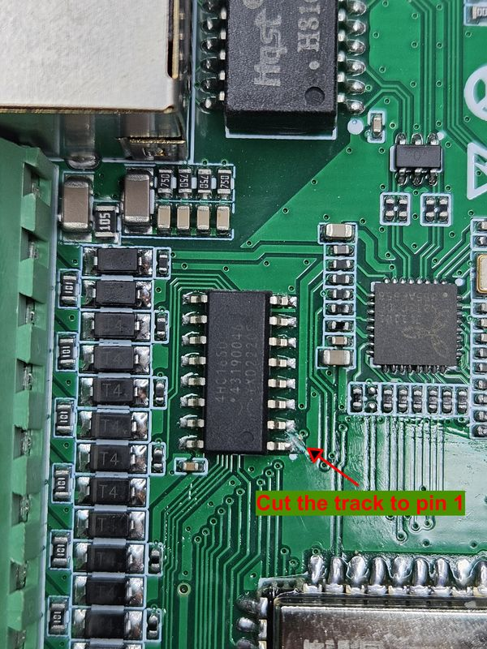

# 8-channel DTWONDER relay board by Dingtian Tech modification to ESPHome

Shenzhen Dingtian Technologies Co.,Ltd has a [DTWONDER series of relays](https://github.com/dtlzp/relay_dev_demo) that 
have 2 to 32 relays on the board based on ESP32 module. They have neat enclosure that can be attached to a DIN rail, 
a diode rectifier, so it can be powered from an AC power source up to 24V, diode protected inputs allows to connect to 
sources with more than 3.3V, and a LAN interface. It is also equipped with RS485 or CAN bus connectors. It makes it a 
perfect out-of-the-box solution for different automation projects.

But there is one disadvantage - it is shipped with a custom hardware which is 
[write-protected](https://karlquinsland.com/dingtian-2ch-relay-with-esphome/), so you are not able to flash anything 
else rather than update the firmware based on their available SDK. Dingtian Tech may ship you the unlocked version, but
it is not the default option, so if you ordered the board as it is, most likely you have the protected version. 
The built-in firmware is actually good and allow to connect to the board via API or MQTT, which allows to work with 
Home Assistant, but in not _that_ native way. The author noticed, for example, that with MQTT connection after Home 
Assistant restarts, board inputs become unavailable unless HA advertising is triggered again.

So for anyone using the board with the Home Assistant, there is an essential feeling to flash it with ESPHome, but 
there is another thing except protected ESP32. In the 
[same post](https://karlquinsland.com/dingtian-2ch-relay-with-esphome/) 2-relay config was provided which can be adapted
to 4 relay as well, as they are directly connected to ESP32 IOs. But 8, 16, and 32 relays boards have HC165 and HC595 
IO expanders share 4 control wires which is not supported by ESPHome. But some soldering will help.  

**Note: the config was tested on the 8 relay module pcb version 3.6.9 without checking RS485 and CAN bus. So only relays,
inputs, factory LED and button are tested.**

First off, you need the unlocked version of the board. If you ordered the locked one, ESP32 is needed to be replaced 
with the new one. Desoldering the ESP32 module is challenging because it has a GND pad at the bottom side. So you will 
need a desoldering station with an air gun. There are other options may be googled how to desolder it, but they were not 
checked. New modules are available starting around $2.5, just make sure to order the same module as on the board.

After the new module is installed, it can be flashed with ESPHome via the debug connector:

 [image source](https://github.com/dtlzp/relay_dev_demo/tree/main/gpio_pinout)

The provided ESPHome config exposes: 8 relays as `switch`, 8 inputs as `binary-sensor`, 'Factory button' as `binary-sensor` and 
'Factory LED' as `switch`. There is a commented code for CAN bus or RS485 based on the available pinout, but it was not 
tested as the author does not have any of those devices by hand.

The config is just a baseline to hardware access. Other ESPHome components may be added if needed.

The manufacturer provides the pinout for the board

 [image source](https://github.com/dtlzp/relay_dev_demo/tree/main/gpio_pinout)

though there is one missing pin on the provided by the manufacturer pinout. ESP32 IO32 (pin 8) is connected to pin 1 
HC165 (SH/LD). So with this schematic HC595 and HC165 share 4 pins to control. And even ESPHome allows to use same pins 
for different components, this particular configuration does not work. If you want to use both HC165 (any of inputs) and 
HC595 (any of relays) in your project, you need to do some modification to the board involving soldering. Changes are
revertable though.

From a few experiments it turned out that CLK pin can still be shared between HC165 and HC595, but others must be 
decoupled. Likely, pin 15 HC165 (CLK_INH) is optional and we can just remove it from the config and connect it to 
GND - pin 8 HC165. The pin 1 (SH/LD), unfortunately, is required, so we have to find an unused ESP32 I/O pin. Based on 
the pinout above the only unused pin is 14th - IO12, which is a strapping pin, but as the board uses other strapping 
pins as well, it should not make any difference. So we need to connect pin 1 HC165 to pin 14 ESP32.

**Warning! These changes are applicable to the PCB version 3.6.9. If you have another one, check the default pinout 
first and then find the need track to cut and pins to connect.**

First off, cut the existing tracks to HC165. To pin 1 - it is pretty easy, next to the pin:

and to pin 15 - it is on the bottom of the pcb, but the track is pretty visible - it is the longest one towards I5 and 
I4 connectors marked on the PCB: 

now make new connections between pin 8 and 15 HC165 and pin 14 ESP32 and pin 1 HC165: 

That's it. After this mod both HC165 and HC595 may work independently in ESPHome with the provided config.
